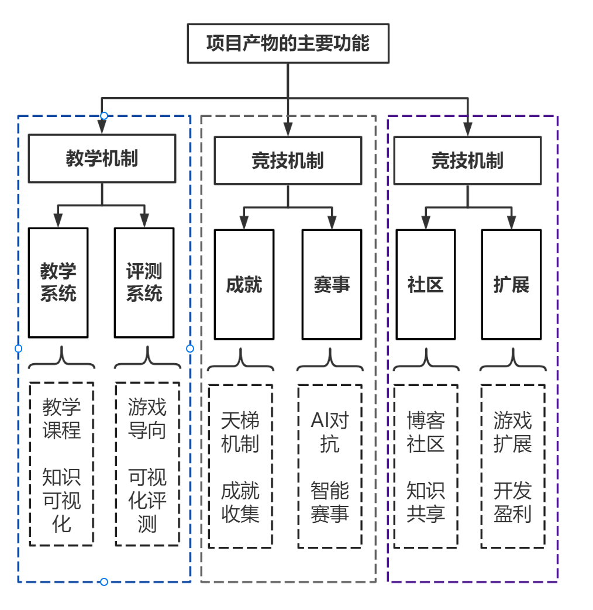
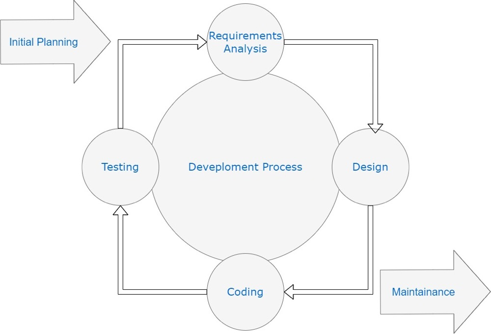

# 
开题报告

<table>
    <tr>
    	<td><b>课程</b></td>
    	<td>软件工程</td>
    </tr>
    <tr>
    	<td><b>学年</b></td>
    	<td>2023年</td>
    </tr>
    <tr>
    	<td><b>成员</b></td>
    	<td>唐喆 贾思琪 郑腾扬 杨锐佳 谢岳良</td>
    </tr>
    <tr>
    	<td><b>选题</b></td>
    	<td>人工智能在线游戏教学网站</td>
    </tr>
</table>

## 分工

我们的分工暂定如下：

| 姓名   | 学号     | 分工                        |
| ------ | -------- | --------------------------- |
| 唐喆   | 20337111 | 产品负责人（Product Owner） |
| 贾思琪 | 20336022 | Scrum团队成员1（开发人员）  |
| 郑腾扬 | 20337161 | Scrum团队成员2（测试人员）  |
| 杨锐佳 | 20337143 | Scrum团队成员3（UI设计师）  |
| 谢岳良 | 20337133 | Scrum主管（Scrum Master）   |

以上分工仅供参考，实际小组分工可能会根据实际情况进行调整。

**TIPS: 详细分工在拟采用软件过程阐述**。

## 场景

我们希望构建一个平台，提供各种人工智能技术和领域的学习资源。用户可以根据自己的兴趣和需求，选择不同类型的算法进行学习，例如图像识别、自然语言处理、机器学习等。

平台提供各种丰富的教育资源，包括学习材料、视频教程、实验室环境和交互式示例。这些资源旨在帮助用户快速掌握算法的基本概念和实现方法，并将这些知识应用于具体的项目中。

除了这些资料，平台还提供了一系列有趣的游戏，这些游戏可以让用户将所学的AI技术实践运用。例如，用户可以编写AI来通关游戏，在实现人工智能算法的同时收集成就徽章。此外，其他游戏模式还包括多用户对战和排名，用户可以与其他人比赛，优化自己的AI，并提升排名。

为了进一步提高用户的学习效果，平台还提供了社区区域，让用户分享项目和学习经验，从而扩展他们的知识，并能够接受其他社区成员的反馈和支持。

平台应用场景大致有一下几点：

1. **学生学习场景**：该网站可以供学生使用，以加深对人工智能的理解和提高技能。学生可以通过在线评测测试自己的知识水平，并通过游戏来增强他们的理解。
2. **教育机构场景**：该网站可以作为教育机构的辅助教学工具，帮助教师更好地教授人工智能相关的课程。教师可以利用在线评测来评估学生的学习进度和水平，并推荐适当的游戏练习。
3. **企业培训场景**：该网站可以供企业使用，以提高员工的人工智能技能。企业可以将其作为培训资源，并使用在线评测来评估员工的技能水平，并推荐适当的游戏练习。
4. **人工智能研究场景**：该网站可以作为人工智能研究领域的参考资源。研究人员可以通过在线评测来测试他们的模型或算法的准确性和效率，并使用游戏来验证他们的理论。

我们最后预想中构建的人工智能教学和游戏网站，能汇聚教育、实践和社区于一体，为用户提供了便捷而有趣的方式来学习和应用人工智能技术。这个应用于人工智能（AI）教学的在线评测与游戏网站可以在很多场景中使用，包括学生、教育机构、企业和研究领域。它可以帮助提高人们对人工智能的理解和技能，促进人工智能的发展和应用。

## 功能

### 教学机制

1. **教学系统**：网站提供了教学课程以及相关知识的可视化、可操作，用户可以在自行演示中更好的理解算法
2. **评测系统**：网站提供了多种游戏框架的可视化评测，用户提交训练的关键代码，网站能够实时展现用户提交代码的训练的游戏结果，使得用户在学习中编写AI来通关多种游戏

### 竞技机制

1. **成就**：网站提供了不同玩家的AI对战功能，例如应用于坦克大战等对抗类游戏。为多种游戏建立了rank天梯机制、成就收集机制，激励玩家通过编写AI相互对抗、相互学习
2. **赛事**：网站定期开展人工智能对抗类比赛，以激励用户的学习积极性和提高用户的学习创新能力

### 盈利机制

1. **社区**：网站提供了博客社区功能，用户之间可以进行知识分享、程序开源、付费解答
2. **扩展**：网站提供了自定义游戏上传功能，用户能够提交自己的编写的游戏来丰富网站的内容，以此来帮助拓展网站的教学和知识分享功能，也为相关的游戏开发展带来一定的收益

## 愿景描述

我们的愿景是打造一款应用于人工智能教学的在线评测与游戏网站，为所有希望了解和掌握人工智能技术的用户提供一个全面、易上手、有趣的学习平台。我们的目标是成为全球领先的人工智能教育平台，帮助用户轻松掌握各类统计学习、深度学习、强化学习等算法，让用户可以通过实践应用，深入理解人工智能技术。

我们的网站提供了丰富的教学资源和指导，用户可以通过在线课程、实践任务、编写AI通关游戏等方式来学习和实现各类人工智能算法。同时，我们也提供了多种有趣的游戏，让用户可以将所学的知识应用于实际场景中，提高对人工智能技术的理解和掌握。

我们的产品形态包括：编写AI通关游戏、多玩家通过优化AI进行对战和排名、基于博客社区的知识的扩展与分享等。通过这些产品形态，我们希望为用户提供多种实践机会，让用户可以在游戏中更好的理解和学习人工智能知识。

我们的团队致力于打造一个优秀的人工智能教育平台，为用户提供最好的学习体验。我们相信，通过我们的努力，可以为更多用户提供高质量的人工智能教育资源，让更多人能够轻松掌握人工智能技术，从而为推动人工智能技术的发展做出积极的贡献。

## 拟采用软件过程

针对上述软件，经过小组讨论，我们决定采用敏捷软件开发过程。敏捷开发是一种迭代和增量的开发方法，强调快速、灵活、反应迅速的开发过程，能够适应需求变化和不断发展的用户需求。

我们将敏捷开发过程分为以下几个阶段：

| 阶段           | 描述                                                         |
| -------------- | ------------------------------------------------------------ |
| 计划(规划)阶段 | 小组成员充分讨论，确定开发的软件方向和主要功能。进行可行性分析，对现有的技术进行充分调研，确定产品各层具体实现方式，明确技术路线。 |
| 需求分析阶段   | 清楚了解用户需求中的产品功能、特性、性能、界面和具体规格等，分析确定这一个开发周期软件产品要达到的目标，据此确定需要添加的各个模块的具体功能。 |
| 设计阶段       | 根据上一阶段需求分析的结果，考虑如何设计实现产品。           |
| 程序实现阶段   | 将产品各个部分任务合理分配，小组成员各司其职，完成各部分任务，并进行整合。 |
| 测试阶段       | 对产品各个功能进行测试，验证所实现的功能是否达到这一阶段的目标，保证产品的稳定性、安全性。然后，开始写一个迭代周期或者发布产品，进入运行和维护阶段。 |
| 维护阶段       | 产品提供了bug反馈的渠道，由小组成员进行产品的后续的缺陷修复。用户也可以提交对产品功能的建议，再由成员进行产品的升级，增加新功能等。 |

通过初步讨论，我们将本组五名组员分别对应到了敏捷开发的五个角色，分工如下：

| 角色                        | 描述                                                         |
| --------------------------- | ------------------------------------------------------------ |
| 产品负责人（Product Owner） | 负责梳理用户需求和反馈，制定产品优先级和需求规格，以及协调开发团队和用户之间的沟通。这个角色可以由一位团队成员担任，负责整理用户反馈和需求，制定产品规划和优先级，以保证产品的功能和性能能够满足用户需求和期望。 |
| Scrum团队成员1（开发人员）  | 负责开发和实现产品功能，编写代码和测试产品。这个角色可以由一位团队成员担任，负责开发和实现产品的功能和性能，并保证代码的质量和可维护性。 |
| Scrum团队成员2（测试人员）  | 负责测试产品，发现并报告问题和缺陷。这个角色可以由一位团队成员担任，负责测试产品的功能和性能，发现并报告问题和缺陷，以保证产品的质量和稳定性。 |
| Scrum团队成员3（UI设计师）  | 负责产品的用户界面设计和优化，使得产品具有良好的用户体验。这个角色可以由一位团队成员担任，负责设计和优化产品的用户界面，以保证产品的易用性和美观性。 |
| Scrum主管（Scrum Master）   | 负责协调和管理Scrum团队的工作，协调各个团队之间的协作和沟通，解决问题和推进工作的顺利进行。这个角色可以由一位团队成员担任，负责协调和管理团队的工作，解决问题和推进工作的顺利进行，以保证产品的高效开发和质量保障。 |

在实际开发中，每个阶段都需要小组成员紧密协作和沟通，确保产品的高质量和用户满意度。同时，团队成员还需要根据实际情况和用户反馈进行灵活调整和改进，以保证产品的不断优化和升级。
